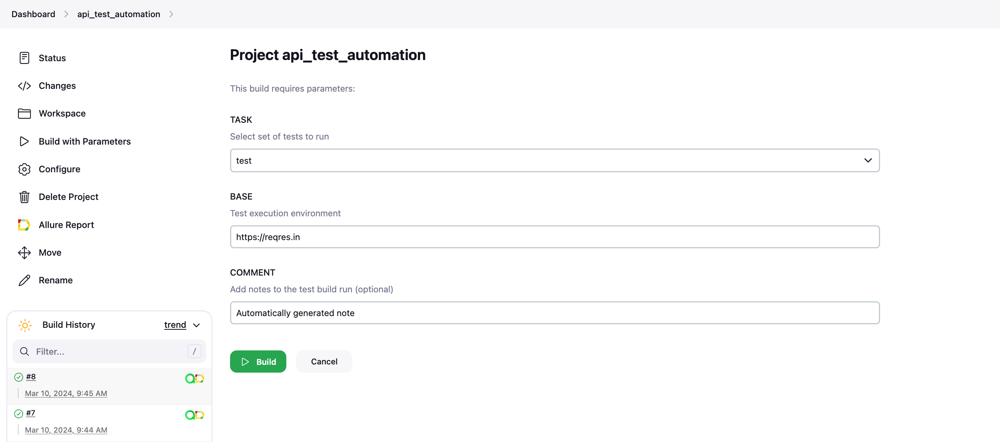
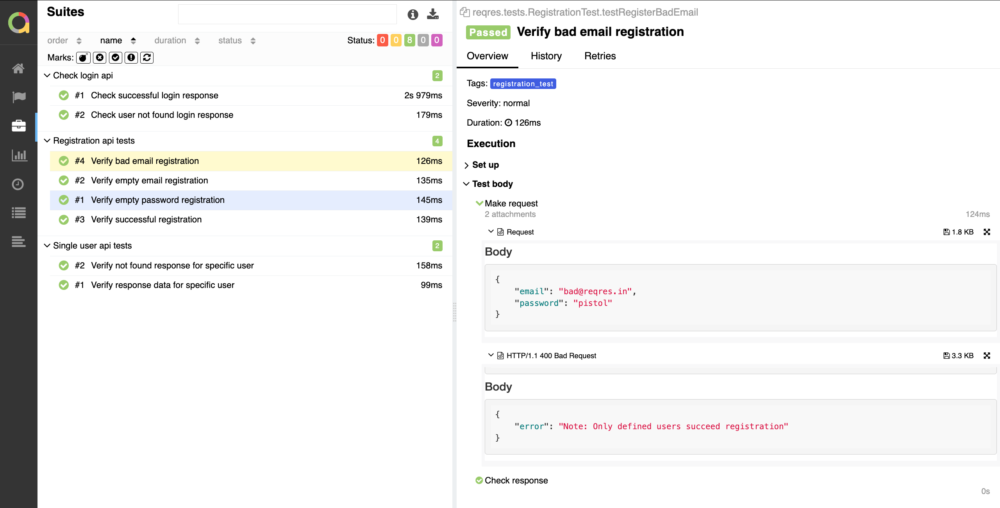
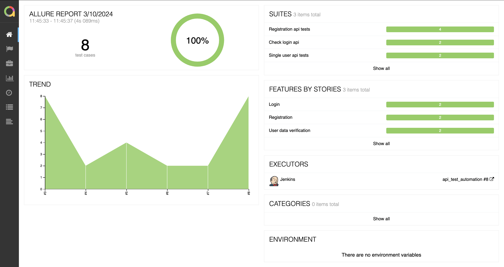
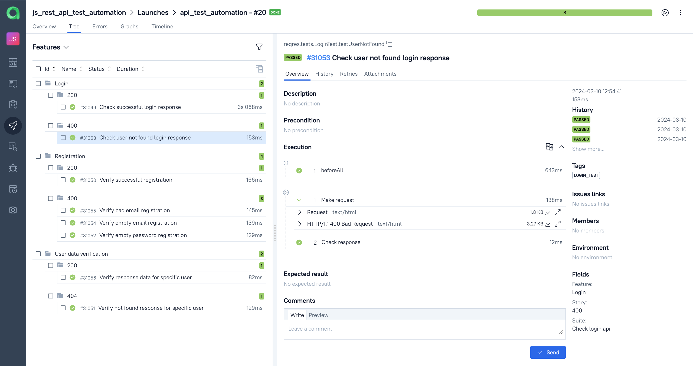
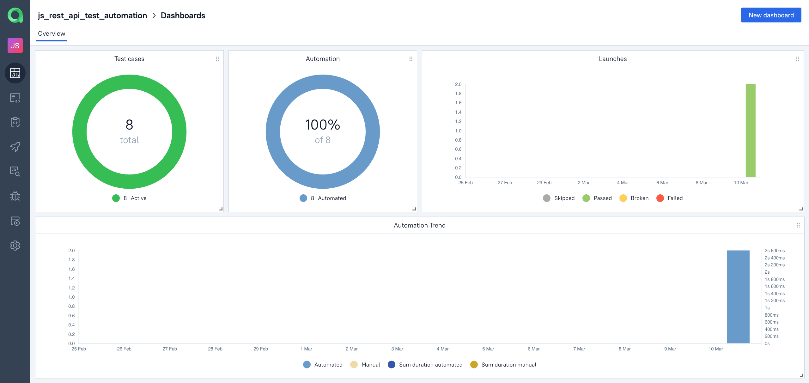
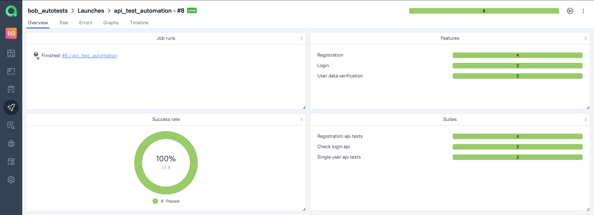
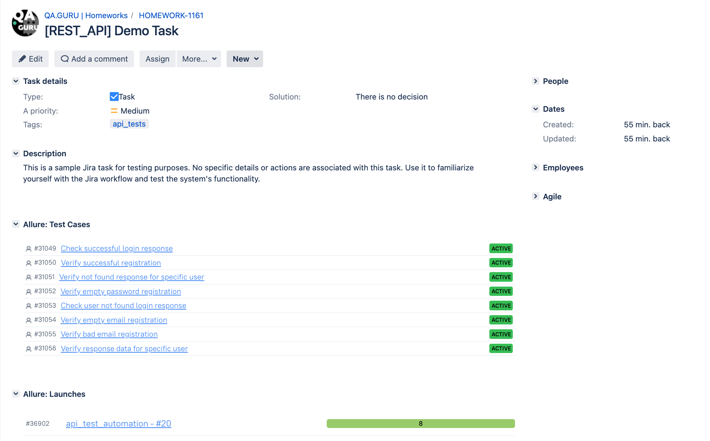
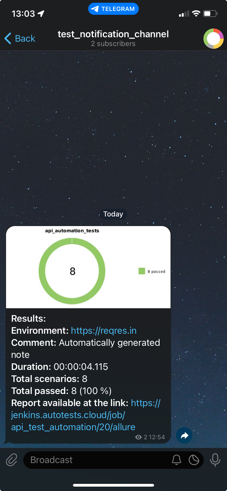

# [Reqres.in](https://reqres.in) API test automation project demo


----
## 📂 Content

- <a href="#tools"> Tools</a>
- <a href="#cases"> Test cases</a>
- <a href="#autotests"> Running Automated Tests</a>
- <a href="#jenkins"> Jenkins Build</a>
- <a href="#allureReport"> Example of Allure Report</a>
- <a href="#allure"> Integration with Allure TestOps</a>
- <a href="#jira"> Integration with Jira</a>
- <a href="#telegram"> Telegram notifications</a>

____
<a id="tools"></a>
## 🛠️ Tools

<p align="center">
<a href="https://www.java.com/"></a>
<a href="https://www.java.com/"></a>
<a href="https://www.atlassian.com/ru/software/jira/"></a>
<a href="https://allurereport.org/"></a>
<a href="https://qameta.io/"></a>
<a href="https://gradle.org/"></a>
<a href="https://junit.org/junit5/"></a>
<a href="https://www.jenkins.io/"></a>
<a href="https://web.telegram.org/"></a>
</p>

____
<a id="cases"></a>
## 🗒️ Test cases

#### Login Feature
- Check user not found login response
- Check successful login response

#### Registration Feature
- Verify successful registration
- Verify bad email registration
- Verify empty email registration
- Verify empty password registration

#### User Data Verification Feature
- Verify not found response for specific user
- Verify response data for specific user

----
## ▶️ Running the API tests

To run **all** the tests:
```zsh
gradle clean test
```

To run only **login** tests:
```zsh
gradle clean login_test
```

To run only **registration** tests:
```zsh
gradle clean registration_test
```

To run only **signle user data** tests:
```zsh
gradle clean user_test
```

____
<a id="jenkins"></a>
##  </a> Jenkins Build <a target="_blank"> </a>

> Registration on the [Jenkins](https://jenkins.autotests.cloud/) resource is required for access to Jenkins.

To start the build, go to the "Build with parameters" section, select the necessary parameters, and click "Build".
### Jenkins Build Parameters:
- TASK (set of tests to run)
- BASE (tested site base url)

<p align="center">

</p>

> After the build is completed, icons for "Allure Report" and "Allure TestOps" will appear next to the build number in the "Build History" section. Clicking on these icons opens pages with the generated HTML report and test documentation, respectively.

____
<a id="allureReport"></a>
##  </a> Example of <a target="_blank" href="https://jenkins.autotests.cloud/job/api_test_automation/20/"> Allure Report </a>

<p align="center">

</p>

<p align="center">

</p>

____
<a id="allure"></a>
##  </a> Integration with <a target="_blank" href="https://allure.autotests.cloud/project/3952/dashboards"> Allure TestOps </a>

On the *Dashboard* in **Allure TestOps**, you can see the statistics of the number of tests: how many of them are added and executed manually, how many are automated. New tests and test run results are sent through the integration with each build.

<p align="center">

</p>

<p align="center">

</p>

<p align="center">

</p>

____
<a id="jira"></a>
##  </a> Integration with <a target="_blank" href="https://jira.autotests.cloud/browse/HOMEWORK-1155"> Jira </a>

Integration with **Allure TestOps** and **Jira** is implemented. In the Jira task, you can see which test cases were written as part of the task and their execution results.

<p align="center">

</p>

____
<a id="telegram"></a>
##  Telegram notifications via bot

After the build is complete, a **Telegram** bot automatically processes and sends a message with the test run report to a specifically configured chat.

<p align="left">

</p>
